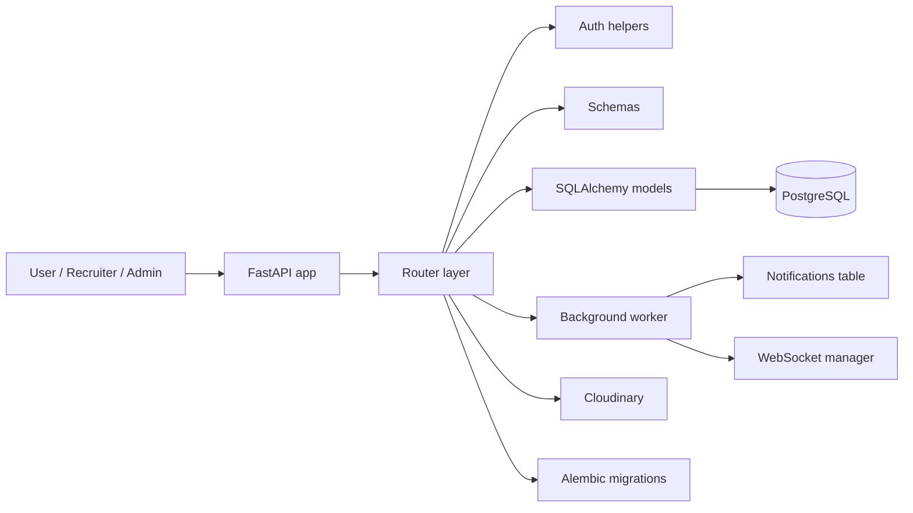
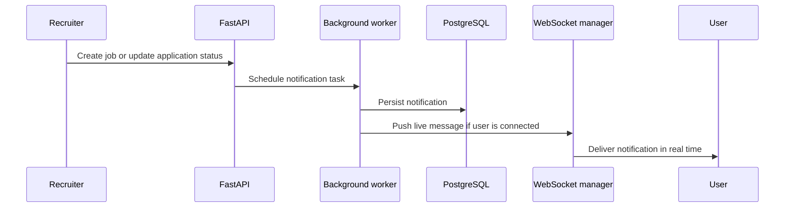

# FastAPI Job Portal

Backend for a recruitment platform built with FastAPI, PostgreSQL, and SQLAlchemy 2.0 async ORM.

The API supports three roles: user, recruiter, and admin. Users can search jobs, apply, and manage their professional profile. Recruiters can create and manage postings, review applicants, and update application status. Admins can activate or deactivate users.

The service is organized around a small set of focused modules: routers, database models, request and response schemas, JWT authentication helpers, a WebSocket connection manager, and a background worker for notification processing. Image uploads are handled through Cloudinary, and Alembic is used for schema migrations.

## Key Features

- Async FastAPI API with SQLAlchemy 2.0 mapped models and async sessions
- JWT authentication with role-based access control
- Job search, job detail lookup, job applications, and application tracking
- Recruiter workflows for posting jobs, opening or closing jobs, and updating application status
- User profile management for experience, projects, skills, socials, and profile images
- Cloudinary-backed image uploads with replacement of the previous profile image
- WebSocket notifications backed by background task processing
- Pagination on list endpoints
- Structured logging and HTTP status handling
- Alembic migrations and Docker support

## Tech Stack

| Layer | Stack |
| --- | --- |
| API | FastAPI |
| Database | PostgreSQL |
| ORM | SQLAlchemy 2.0 async |
| Migrations | Alembic |
| Auth | JWT via python-jose |
| Password hashing | passlib with Argon2 |
| File uploads | Cloudinary |
| Realtime | WebSockets |
| Background work | FastAPI background tasks |
| Containers | Docker |

## High-Level Architecture



Requests enter through `main.py`, are routed in `routes.py`, validated with Pydantic schemas, and persisted through the async database layer in `database.py`. Notification events are queued with background tasks and delivered over WebSockets when a client is connected.

## Folder Structure

```text
.
├── main.py
├── routes.py
├── models.py
├── schemas.py
├── auth.py
├── database.py
├── security.py
├── tokens.py
├── ws_manager.py
├── worker.py
├── alembic/
├── alembic.ini
├── Dockerfile
└── requirements.txt
```

## Database Overview

The schema is centered around a few core entities:

- `UsersDB` stores credentials, role, profile fields, activity flags, and profile image data.
- `JobsDB` stores recruiter-created postings, status, salary, requirements, and ownership.
- `ApplicationsDB` links a user to a job and tracks the application status.
- `Experience`, `Projects`, `Skills`, `UserSkills`, and `Socials` make up the user profile surface.
- `NotificationsDB` stores messages that were generated by system events.

The model layer uses SQLAlchemy relationships and unique constraints where they matter, including one application per user per job, and unique project / skill associations for a user.

## Authentication & Authorization

Authentication is JWT-based. `POST /login` issues a bearer token, and protected endpoints resolve the current user from the token subject.

Authorization is role-based:

- `user` can browse jobs, apply, manage profile data, and read notifications
- `recruiter` can create jobs, manage their own postings, and review applications
- `admin` can list users and change account activation state

The API returns `401` for missing or invalid credentials and `403` when the token is valid but the role is not allowed.

## API Modules

The route file is grouped by workflow rather than by CRUD shape:

- Authentication: register and login
- Jobs: search, job detail, create, update status, close or open, and delete
- Applications: apply to jobs, list user applications, and review applications for recruiter-owned jobs
- Profile: update basic profile data, upload profile images, and manage experience, projects, skills, and socials
- Admin: list users, activate users, and deactivate users
- Notifications: fetch stored notifications and receive live updates over WebSocket

## Notification Flow



The worker resolves the message template, writes the notification to the database, and sends it immediately to any connected client through the connection manager.

## Running Locally

```bash
git clone https://github.com/<your-username>/fastapi-job-portal.git
cd fastapi-job-portal

python -m venv .venv
# Windows
.venv\Scripts\activate
# macOS / Linux
source .venv/bin/activate

pip install -r requirements.txt
```

Create a `.env` file with the required variables, then start the API:

```bash
uvicorn main:app --reload
```

The API docs are available at `http://127.0.0.1:8000/docs`.

## Docker Setup

```bash
docker build -t fastapi-job-portal .
docker run --rm -p 8000:8000 --env-file .env fastapi-job-portal
```

The container starts Uvicorn on port `8000` and reads configuration from the environment file.

## Environment Variables

| Variable | Required | Description |
| --- | --- | --- |
| `DATABASE_URL` | Yes | Async PostgreSQL connection string used by SQLAlchemy |
| `SECRET_KEY` | Yes | Secret used to sign JWT access tokens |
| `ALGORITHM` | Yes | JWT signing algorithm |
| `ACCESS_TOKEN_EXPIRE_MINUTES` | No | Token lifetime in minutes; defaults to `30` |
| `CLOUDINARY_CLOUD_NAME` | Yes for uploads | Cloudinary cloud name used for profile images |
| `CLOUDINARY_API_KEY` | Yes for uploads | Cloudinary API key |
| `CLOUDINARY_API_SECRET` | Yes for uploads | Cloudinary API secret |

## Example API Workflow

1. A recruiter logs in and creates a job posting.
2. A user finds the job through search, opens the detail view, and submits an application.
3. The recruiter reviews the application and updates its status.
4. The background worker stores a notification for the user and pushes it over WebSocket if the client is connected.
5. The user can also fetch the same notification later from the notifications endpoint.

## Future Improvements

- Split the routing layer into feature-based modules for improved maintainability.
- Expand job search with filtering, sorting, and pagination by additional fields.
- Add automated test coverage for authentication, applications, notifications, and profile management.
- Introduce a dedicated notification service to separate message generation from business logic.
- Add rate limiting to authentication and file upload endpoints.
- Containerize the complete development environment using Docker Compose.
- Introduce CI/CD with GitHub Actions for automated testing and deployment.

## License

MIT License